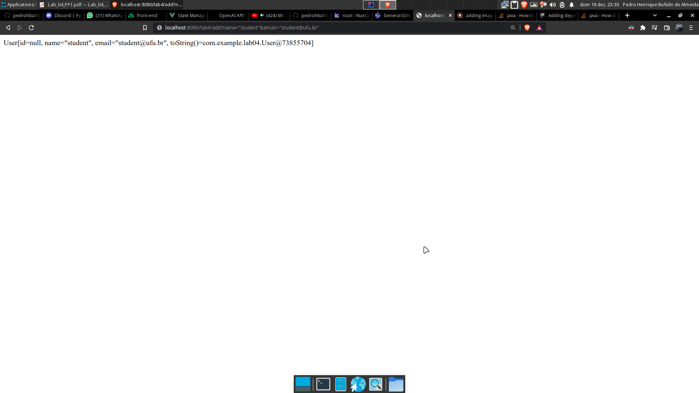

# Respostas

8. `Controlller` está funcionando corretamente, veja o retorno do objeto pelo servidor:

9. Ocorre um erro pois o servidor não possui essa rota. 

13. formulario funciona de acordo com o requisitado, retornando o um JSON em em `string` do modelo criado:

14. Ocorre um erro, uma vez que os valores esperados não batem com os recebidos.

